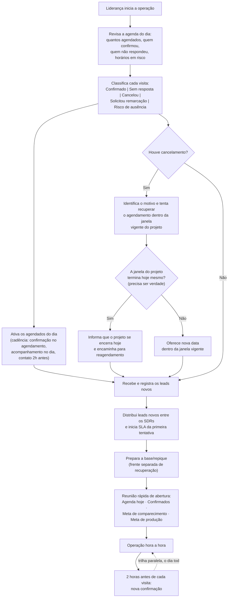

# Fluxograma Diário — Gestão Comercial

**Instituto Gourmet Santo André**

> A manhã não começa com "confirmar visitas". Começa protegendo o comparecimento da agenda do dia — porque, no dia seguinte ao agendamento, o foco passa a ser trazer quem já está agendado. Só depois disso a operação avança para leads novos e base/repique. É a diferença entre administrar uma lista de tarefas e dirigir uma operação comercial.

## As três frentes da manhã, em ordem de prioridade

1. **Agenda do dia — prioridade máxima.** Proteger o comparecimento de quem já foi conquistado.
2. **Leads novos — prioridade comercial.** Alimentar o funil a partir do que chegou do marketing.
3. **Base/repique — recuperação e produtividade.** Frente separada, não misturada com lead novo.

## Ordem exata da rotina

1. **Liderança inicia a operação.** (Se este card for rotina pessoal de uma pessoa específica, pode ficar como "Gabi chega"; como documento oficial, o processo precisa sobreviver a quem ocupa a função.)
2. **Revisa e ativa a agenda do dia.** Antes de qualquer ligação: quantos estão agendados, quem já confirmou, quem ainda não respondeu, quais horários estão em risco.
3. **Classifica cada visita** com um destes status: `Confirmado` | `Sem resposta` | `Cancelou` | `Solicitou remarcação` | `Risco de ausência`. Isso permite saber, às 10h da manhã, exatamente qual é a saúde da agenda do dia.
4. **Ativa os agendados do dia** seguindo a cadência de comparecimento (não é uma ligação isolada): confirmação já registrada no momento do agendamento, acompanhamento ao longo do dia, e nova confirmação 2 horas antes de cada visita.
5. **Se houver cancelamento:** identificar o motivo real e tentar recuperar o agendamento dentro da janela vigente do projeto — não anunciar encerramento por padrão.
6. **Só informar que "o projeto se encerra hoje" se isso for verdade** naquele caso concreto. Se a janela realmente terminar naquele dia, informar isso; caso contrário, oferecer nova data dentro da janela vigente.
7. **Receber e registrar os leads novos.**
8. **Distribuir os leads novos entre os SDRs e iniciar o SLA da primeira tentativa** — o que importa não é só "puxar os leads", é medir quanto tempo se leva para tocar o lead depois que ele chegou.
9. **Preparar a base/repique** como frente própria de recuperação, separada dos leads novos.
10. **Reunião rápida de abertura**, com quatro números (não só a meta de produção):
    - **Agenda hoje:** quantos estão marcados.
    - **Confirmados:** quantos já validaram presença.
    - **Meta de comparecimento:** quantos precisamos trazer.
    - **Meta de produção:** 2 agendamentos/hora, por SDR.
11. **Operação hora a hora**, com a trilha paralela rodando o dia todo: **2 horas antes de cada visita → nova confirmação.**

## Foco diário da operação

Substitui a antiga "meta diária do time" isolada — meta não pode substituir prioridade operacional:

**FOCO DIÁRIO DA OPERAÇÃO**
1. Proteger a agenda do dia.
2. Gerar novos agendamentos.
3. Recuperar oportunidades da base.

*Indicador: meta de produção de 2 agendamentos por hora, por SDR.*

## Fala para cancelamento

Primeiro tentar recuperar — só declarar encerramento se for verdade:

> Entendo. Deixa eu verificar a disponibilidade dentro do prazo do projeto para tentar reorganizar sua visita.

Se a janela realmente terminar naquele dia (e só nesse caso):

> Entendo. Como o projeto se encerra hoje, não consigo garantir uma nova data neste momento. Vou encaminhar sua solicitação para a equipe responsável pelo projeto e verificar se existe a possibilidade de reagendamento. Assim que eu tiver um retorno, entro em contato com você.

A SDR não deve confirmar uma nova data por conta própria, e não deve declarar encerramento do projeto quando isso não for verdade. Ela identifica o motivo, tenta recuperar dentro da janela vigente e, só quando aplicável, registra a solicitação e aguarda a autorização da responsável pelo projeto.
