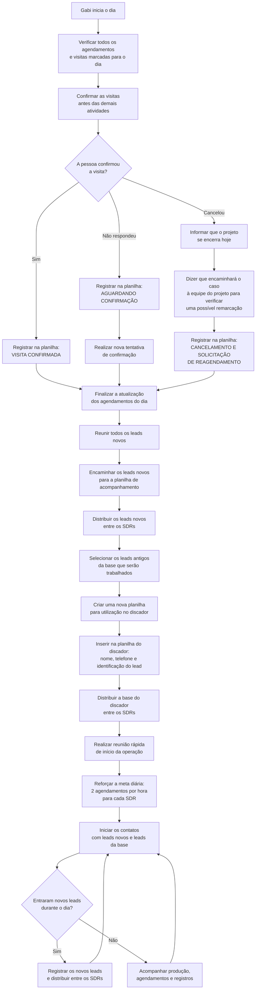

# Fluxograma Diário da Gabi — Gestão Comercial

## Ordem exata da rotina

1. Verificar os agendamentos e as visitas marcadas para o dia.
2. Confirmar todas as visitas antes de iniciar as demais atividades.
3. Registrar na planilha quem confirmou, quem não respondeu e quem cancelou.
4. Quando houver cancelamento, informar que o projeto se encerra hoje, mas que o caso será encaminhado à equipe do projeto para verificar a possibilidade de reagendamento.
5. Reunir todos os leads novos.
6. Inserir os leads novos na planilha de acompanhamento.
7. Distribuir os leads novos entre os SDRs.
8. Selecionar os leads antigos da base que serão trabalhados.
9. Preparar uma nova planilha para o discador.
10. Distribuir a base do discador entre os SDRs.
11. Fazer uma reunião rápida com o time.
12. Reforçar a meta de dois agendamentos por hora para cada SDR.
13. Abastecer os SDRs com os leads que entrarem ao longo do dia.
14. Acompanhar os agendamentos e o preenchimento das planilhas.

## Fala para cancelamento

> Entendo. Como o projeto se encerra hoje, não consigo garantir uma nova data neste momento. Vou encaminhar sua solicitação para a equipe responsável pelo projeto e verificar se existe a possibilidade de reagendamento. Assim que eu tiver um retorno, entro em contato com você.

A SDR não deve confirmar uma nova data por conta própria. Ela registra a solicitação e aguarda a autorização da responsável pelo projeto.
